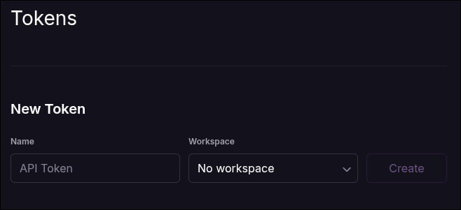

# Deployment

Production runs on [Railway](https://railway.com). The backend, frontend, and Postgres database live in one Railway project defined by [`.railway/railway.ts`](.railway/railway.ts).

Railway is not required for local evaluation. Use Docker Compose, `cargo run`, and `pnpm dev` for local development. See [`README.md`](README.md).

## Topology

- `Postgres` - Railway-managed Postgres.
- `shortener-api` - Rust backend deployed from a GHCR image selected by `SHORTENER_API_TAG`.
- `web` - SolidJS frontend built from the repo root with `apps/web/Dockerfile`, served by Caddy.

Default production domains:

- Frontend: `https://shorter.inve.rs`
- Backend: `https://s.inve.rs`

The backend `HOST` value is the bare API host (`s.inve.rs`), not a URL. The API rejects schemes and paths in `HOST` because it uses this value for self-reference checks.

## Railway Inputs

`.railway/railway.ts` reads these environment variables when the CLI evaluates the config:

| Variable | Default | Purpose |
| --- | --- | --- |
| `SHORTENER_API_TAG` | current fallback in `.railway/railway.ts` | GHCR image tag for `shortener-api` |
| `SHORTENER_API_DOMAIN` | `s.inve.rs` | API custom domain and backend `HOST` value |
| `SHORTENER_WEB_DOMAIN` | `shorter.inve.rs` | frontend custom domain and backend CORS origin |
| `RAILWAY_GITHUB_BRANCH` | unset | optional pre-merge branch override for the web GitHub source |

Leave `RAILWAY_GITHUB_BRANCH` unset for normal production deploys so Railway builds the frontend from the repository default branch.

## Manual Deploy

From the repo root:

```bash
railway login
railway link
```

Preview the live diff:

```bash
SHORTENER_API_TAG=0.1.3 \
SHORTENER_API_DOMAIN=s.inve.rs \
SHORTENER_WEB_DOMAIN=shorter.inve.rs \
railway config plan
```

Apply if the plan is safe:

```bash
SHORTENER_API_TAG=0.1.3 \
SHORTENER_API_DOMAIN=s.inve.rs \
SHORTENER_WEB_DOMAIN=shorter.inve.rs \
railway config apply
```

For pre-merge testing from a deployment branch:

```bash
RAILWAY_GITHUB_BRANCH=chore/deploy-railway \
SHORTENER_API_TAG=0.1.3 \
SHORTENER_API_DOMAIN=s.inve.rs \
SHORTENER_WEB_DOMAIN=shorter.inve.rs \
railway config plan
```

## Release Deploys

The release flow is handled by [`.github/workflows/release-plz.yml`](.github/workflows/release-plz.yml):

1. `release-plz` creates a release tag such as `v0.1.3`.
2. The release workflow builds and pushes `ghcr.io/zeon256/shortener-api:0.1.3`.
3. Trivy scans the image.
4. The Railway deploy job runs with `SHORTENER_API_TAG=0.1.3`.
5. The job runs `railway config plan` and `railway config apply --yes`.

The CI job intentionally does not pass `--confirm-destructive`. If a future plan wants to delete a service, domain, or volume, CI should fail rather than destroy resources automatically.

## GitHub Production Environment

Configure these in the GitHub `production` environment:

| Name | Type | Required | Notes |
| --- | --- | --- | --- |
| `RAILWAY_API_TOKEN` | secret | yes | Railway account-scoped API token |
| `RAILWAY_PROJECT_ID` | variable | yes | Railway project UUID |
| `RAILWAY_ENVIRONMENT` | variable | optional | Defaults to `production` in CI |
| `SHORTENER_API_DOMAIN` | variable | optional | Defaults to `s.inve.rs` |
| `SHORTENER_WEB_DOMAIN` | variable | optional | Defaults to `shorter.inve.rs` |

Recommended GitHub environment protections:

- Restrict deployment branches to `main`.
- Add required reviewers if production deploys should be manually approved.

## Railway Token Quirk

For `RAILWAY_API_TOKEN`, create an account-scoped token with the Railway account token workspace dropdown set to **No workspace**.



Do not use these for the current deploy job:

- A Railway project token. Project tokens are for `RAILWAY_TOKEN`, not `RAILWAY_API_TOKEN`.
- A workspace-scoped account token. These may work against parts of the Railway API, but the Railway CLI can reject them for `railway link` with `Unauthorized`.

Local sanity check:

```bash
RAILWAY_API_TOKEN=<account-token-with-no-workspace> \
railway link --project <project-id> --environment production
```

If that command fails with `Unauthorized`, the token type/scope is wrong for this workflow.

## CDN

Railway CDN settings are not represented in the Railway TypeScript SDK used by `.railway/railway.ts`. If CDN is desired for the `web` service, configure it from the Railway dashboard.

Keep CDN off for `shortener-api`; API responses and redirects should not be cached unless explicitly designed for that.

## Checks

Useful checks after a deploy:

```bash
curl -I https://s.inve.rs/healthz
curl -I https://shorter.inve.rs
curl -I https://shorter.inve.rs/some/deep/spa/route
```

CORS preflight check:

```bash
curl -i -X OPTIONS 'https://s.inve.rs/api/v1/shorten' \
  -H 'Origin: https://shorter.inve.rs' \
  -H 'Access-Control-Request-Method: POST' \
  -H 'Access-Control-Request-Headers: content-type'
```

Expected preflight header:

```txt
access-control-allow-origin: https://shorter.inve.rs
```
