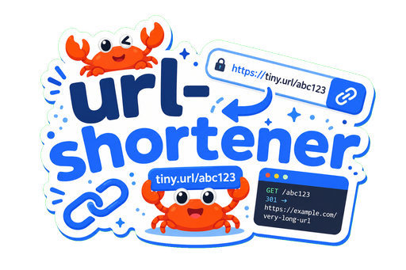

# url-shortener

<p align="center">
  
</p>

## Table of Contents

- [Running end-to-end (Docker Compose)](#running-end-to-end-docker-compose)
- [Deployment](DEPLOY.md)
- [Building from source](BUILDING.md)

---

## Running end-to-end (Docker Compose)

> [!TIP]
> If you want to run the app end-to-end without installing Rust, Node.js, or pnpm use this!

### Compose profiles

[`compose.yml`](compose.yml) splits services into two groups:

| Service | Profile | Port (default) | Purpose |
| --- | --- | --- | --- |
| `postgres` | *(none — always starts)* | `5432` | Database |
| `api` | `app` | `8000` | Rust backend |
| `web` | `app` | `8080` | SolidJS frontend (Caddy) |

- **`docker compose up`** — starts **Postgres only**. Use this when running the backend and frontend on your host during development.
- **`docker compose --profile app up`** — starts **Postgres + API + web**, i.e. the full stack end-to-end.

Optional env overrides live in [`.env.example`](.env.example); copy to `.env` if you need different ports or credentials:

```bash
cp .env.example .env
```

### Run the full stack

From the repo root:

```bash
docker compose --profile app up --build
```

The first run builds both images (multistage Dockerfiles) and waits for Postgres to become healthy before starting the API.

When the logs settle, open:

- **Frontend:** [http://localhost:8080](http://localhost:8080) — shorten a URL in the UI
- **Backend:** [http://localhost:8000/healthz](http://localhost:8000/healthz) — should return HTTP 200

The frontend is built with `VITE_BACKEND_URL=http://localhost:8000` (see `.env.example`), so the browser talks to the API on your host loopback.

```bash
docker compose --profile app up --build -d
```

Logs: `docker compose --profile app logs -f`
Stop: `docker compose --profile app down`

### Common pitfalls and debugging (Docker)

- On some OS you can spawn containers with same ports and have no errors. Check that you do not have any existing Docker containers running on the same ports. You can check this with `docker ps` and stop any existing containers with `docker stop <container_id>`. Likewise this applies to locally installed tool that might interfere with the ports.

- If you are running on Windows and have WSL2 installed, make sure that you have the latest version of Docker Desktop installed. You can check this by opening Docker Desktop and checking for updates. If you are running on Linux, make sure that you have the latest version of Docker installed. You can check this by running `docker --version` and comparing it to the latest version on the Docker website.

## Building from source

See [`BUILDING.md`](BUILDING.md) for toolchain prerequisites, building the backend/frontend, cross-compilation, and troubleshooting.

## Deployment

Production runs on [Railway](https://railway.com). The deployment runbook, release CI flow, Railway token notes, and custom-domain configuration live in [`DEPLOY.md`](DEPLOY.md).

Rationale and the IaC-vs-CDN ownership discussion live in [`docs/decision.md`](docs/decision.md) (D3).
